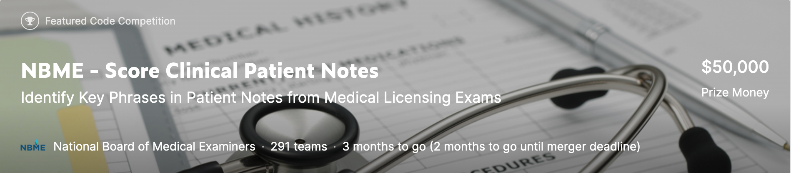

# What?

## Identify Key Phrases in Patient Notes from Medical Licensing Exams

When you visit a doctor, how they interpret your symptoms can determine whether your diagnosis is accurate. 

This is an open Kaggle competition with a $50,000 reward. Details can be [found here.](https://www.kaggle.com/c/nbme-score-clinical-patient-notes/overview)

One part of the medical licensing exam required test-takers to interact with Standardized Patients (people trained to portray specific clinical cases) and write a patient note. Trained physician raters later scored patient notes with rubrics that outlined each case’s important concepts (referred to as features). The more such features found in a patient note, the higher the score.

**Goal**

Identify specific clinical concepts in patient notes. 

Develop an automated method to map clinical concepts from an exam rubric (e.g., “diminished appetite”) to various ways in which these concepts are expressed in clinical patient notes written by medical students (e.g., “eating less,” “clothes fit looser”).

## So what?

Trained physician raters later scored patient notes with rubrics that outlined each case’s important concepts (referred to as features). However, having physicians score patient note exams requires significant time, along with human and financial resources. 

## Now what?

Approaches using natural language processing have been created to address this problem, but patient notes can still be challenging to score computationally because features may be expressed in many ways.

We hope to tackle the biggest practical barriers in patient note scoring, making the approach more transparent, interpretable, and easing the development and administration of such assessments. As a result, medical practitioners will be able to explore the full potential of patient notes to reveal information relevant to clinical skills assessment.

### Data:

- `csv` list of features
- `csv` with raw text of notes as well as labeled target data about which features were present as scored by physicians.

### Evaluation:

- Entries scored my micro-averaged F1 scores. 

We score each character index as:

- TP if it is within both a ground-truth and a prediction,
- FN if it is within a ground-truth but not a prediction, and,
- FP if it is within a prediction but not a ground truth.

Finally, we compute an overall F1 score from the TPs, FNs, and FPs aggregated across all instances.